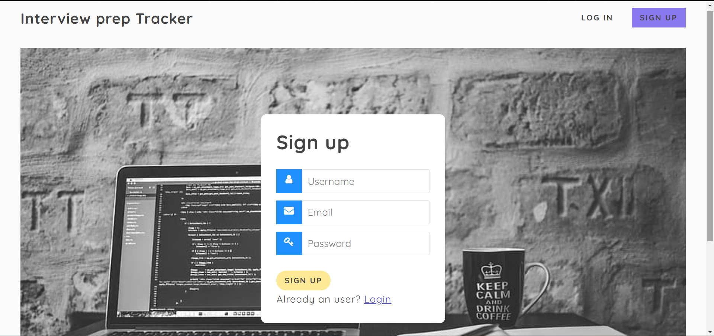

# Interview-Prep-Tracker

This is a web application that helps for the preparation of interviews by providing previous year's experiences of others and also by providing good programming questions to practice.

#### Team Members 
* Vineeth Kumar, Ajay Kumar, Surya Kiran, Mukkanti Saketh

### Key Technologies
* Node.js
* EJS templates
* JavaScript 
* MongoDB
### Features of the Application
* [Home](https://github.com/vineeth357/Interview-Prep-Tracker#home)
* [Programming](https://github.com/vineeth357/Interview-Prep-Tracker#programming)
* [Experiences](https://github.com/vineeth357/Interview-Prep-Tracker#experiences)

### Home

This is an home page before user logged in. User has to login first to use the features of the website

### SignUp

This is the signup page. User can create an account at first once and afterwards user can login directly.

This is the home page after user logins. Now user can use programming and interview experiences features.

### Programming

User can select any topics to pratice and he can also contrebute new question by "Add Question" option at the end of the page.

Thi is the page showing all question of arrays topic. 

Users can contribute good quetions and that has to be approved by admin to showcase in the website

### Experiences

Showing list of companies for which interview experinces are present.

Showing list of interview experinces of Google and we have to select from that list to read any experience

This is the full experience of a candidate of company.

Users can contribute by providing their experiences and that has to be approved by admin to showcase in the website.

